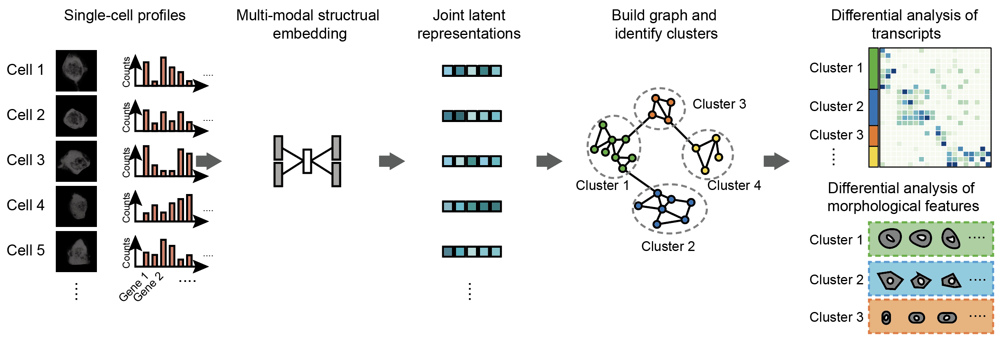

# Demonstration of Running MUSE

This is a Jupyter Notebook for the demonstration of runing MUSE. There are three major functions:

1. Generate simulation data with two modalities;
2. Run MUSE on simulated data and learn joint latent representations;
3. Perform clustering and identify subpopulation on latent representations.
4. Visualize the clusters and quantify the accuracy.

**Fig. 1 | The analysis workflow of MUSE.** **1)** From the same cells, two profiles were obtained; **2)** MUSE combined two modality information into a joint representations; **3)** Each representation were used as features of each cell; **4)** On latent representations, graph clustering was used to identify cell groups that were close in the latent space; **5)** Based on cell clusters, we could further perform differential analysis on either morphological and transcriptional modality, to identify different cell properties.

Detailed introduction for each step was provided in the notebook.

## Depdendency of running the code

To run the code, install the following packages:

- Python >= 3.6
- TensorFlow-GPU >= 1.14.0
- (TensorFlow >= 1.14.0 if only use CPU) 
- Numpy >= 1.16.2
- Scipy >= 1.1.1
- phenograph >= 1.5.2
- sklearn >= 0.20.3
- matplotlib
- muse_sc

All packages can be installed througn `pip install *` command except phenograph, which can be installed by `pip3 install git+https://github.com/jacoblevine/phenograph.git`.

## Copyright
Software provided as is under **MIT License**.

Copyright (c) 2020 Altschuler and Wu Lab

Permission is hereby granted, free of charge, to any person obtaining a copy of this software and associated documentation files (the "Software"), to deal in the Software without restriction, including without limitation the rights to use, copy, modify, merge, publish, distribute, sublicense, and/or sell copies of the Software, and to permit persons to whom the Software is furnished to do so, subject to the following conditions:

The above copyright notice and this permission notice shall be included in all copies or substantial portions of the Software.

THE SOFTWARE IS PROVIDED "AS IS", WITHOUT WARRANTY OF ANY KIND, EXPRESS OR IMPLIED, INCLUDING BUT NOT LIMITED TO THE WARRANTIES OF MERCHANTABILITY, FITNESS FOR A PARTICULAR PURPOSE AND NONINFRINGEMENT. IN NO EVENT SHALL THE AUTHORS OR COPYRIGHT HOLDERS BE LIABLE FOR ANY CLAIM, DAMAGES OR OTHER LIABILITY, WHETHER IN AN ACTION OF CONTRACT, TORT OR OTHERWISE, ARISING FROM, OUT OF OR IN CONNECTION WITH THE SOFTWARE OR THE USE OR OTHER DEALINGS IN THE SOFTWARE.

