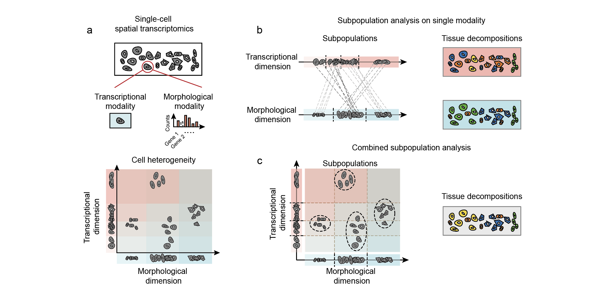
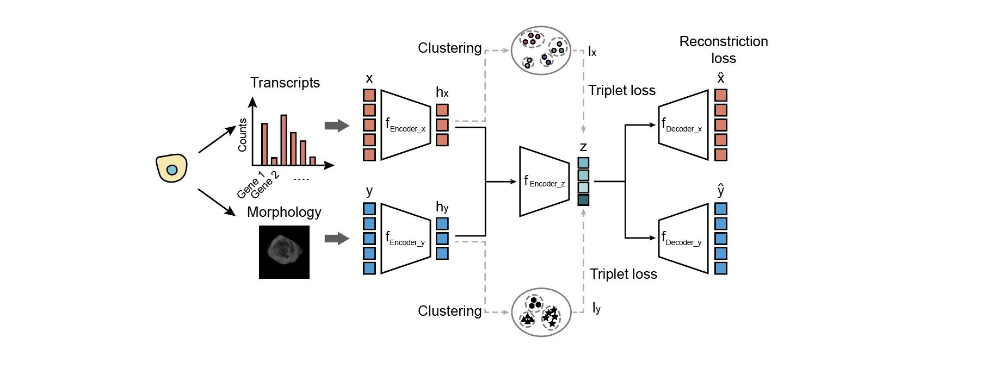
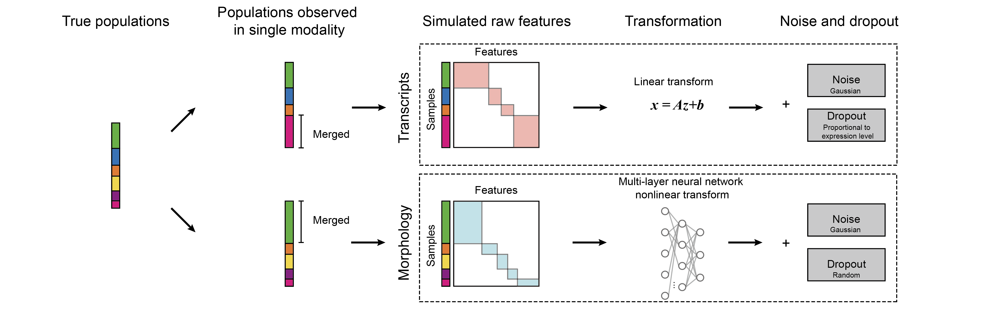

# MUSE: multi-modality structured embedding for spatially resolved transcriptomics analysis

MUSE is a deep learning approach characterizing tissue composition through combined analysis of morphologies and transcriptional states for spatially resolved transcriptomics data.

> Citation: 
> Integrative spatial analysis of cell morphologies and transcriptional states with MUSE. Feng Bao<sup>\*</sup>, Yue Deng<sup>\*</sup>, Sen Wan, Susan, Shen, Bo Wang, Qionghai Dai<sup>\#</sup>, Steven J. Altschuler<sup>\#</sup>, Lani F. Wu<sup>\#</sup>

## Overview

Decomposing cell heterogeniety of complex biological systems is an important step to the comprehensive understanding of their organizations and mechanisms.  Morphologies are the most direct and distinguishable  features for  cell differences. Optical profiling from morphologies has been a powerful and widely used tool to characterize cell identities and quantify cellular/subcellular dynamics at high temporal/spatial resolution and large scale. Complementarily, transcriptional profiles represent  cellular activities. The transcriptional differences among cells can reveal different cell states, linages and subpopulations. With the development of single-cell spatial transcriptomics, we can profile morpholigiclal and transcriptonal properties from the same cell simutaneously. We developed the multi-modality structural embedding (MUSE), a deep learning approach that aggregates the heterogeneity from morphologies and transcripts and dissects tissue subpopulations at finer resolution.


**Fig. 1 | An overview of the study.** (**a**) Single-cell spatial transcriptomics technologies provide cell infromation from both transcriptional and morphological modalities, which reveal cell heterogeneity from different angles. (**b**) Cell differences in the tissue can be characterized based on each single modalties. (**c**) By combining both heterogeneities from two modalities, fine-grained cell subpopulations can be revealed.


**Fig. 2 | The model architecture of MUSE**

MUSE combines features from transcripts (x) and morphology (y) into a joint latent representation z.The self-reconstruction loss encourages the learned joint feature representation (z) to faithfully retain information from the original individual input feature modalities (x and y). The self-supervised learning exploits triple-loss functions to encourage cells with the same cluster label (i.e. with the same pseudo label in either l<sub>x</sub> or l<sub>y</sub>) to remain close—and cells with different cluster labels to remain far apart—in the joint latent space.

## MUSE software package

MUSE requires the following packages for installation:

- Python >= 3.6
- TensorFlow-GPU >= 1.14.0
- (TensorFlow >= 1.14.0 if only use CPU) 
- Numpy >= 1.16.2
- Scipy = 1.4.1
- phenograph >= 1.5.4

To install MUSE package, use
```terminal
pip install muse_sc
```

All required python packages can be installed through `pip` command. We note the latest PhenoGraph (April 24th, 2021) can not work with the latest Scipy well. Therefore we suggest to use scipy==1.4.1 to avoid conflicts.

## Usage

### Import MUSE python package
After installation, import MUSE by

```python
import muse_sc as muse
```

### Learn MUSE features on multi-modality data
MUSE requires feature matrices (`data_x` and `data_y`) and inital sample labels (`label_x` and `label_y`) from two modalities for model training. 

```python
z, x_hat, y_hat, h_x, h_y = muse.muse_fit_predict(data_x,
                                                  data_y,
                                                  label_x,
                                                  label_y,
                                                  latent_dim=100,
                                                  n_epochs=500,
                                                  lambda_regul=5,
                                                  lambda_super=5)
```
where 

```
Parameters:

  data_x:       input for transcript modality; matrix of  n * p, where n = number of cells, p = number of genes.
  data_y:       input for morphological modality; matrix of n * q, where n = number of cells, q is the feature dimension.
  label_x:      initial reference cluster label for transcriptional modality.
  label_y:      inital reference cluster label for morphological modality.
  latent_dim:   feature dimension of joint latent representation.
  n_epochs:     maximal epoch used in training.
  lambda_regul: weight for regularization term in the loss function.
  lambda_super: weight for supervised learning loss in the loss function.


Outputs:

  z:            joint latent representation learned by MUSE.
  x_hat:        reconstructed feature matrix corresponding to input data_x.
  y_hat:        reconstructed feature matrix corresponding to input data_y.
  h_x:          modality-specific latent representation corresponding to data_x.
  h_y:          modality-specific latent representation corresponding to data_y.
```

Inital reference labels (`label_x` and `label_y`) can either be provided by a modality-specific method (eg. use scScope for transcript feature learning and obtain cell clusters) or simply use general feature learning and cluster methods. We provide a demonstration to use PCA to get reference labels in `MUSE_demo.ipynb`.

### Subpopulation analysis
After learning joint latent representations from both modalities by MUSE, subpopulations in the tissue can be discovered by PhenoGraph (https://github.com/jacoblevine/PhenoGraph). It can automatically determine the optimal cluster number. 

```python
import phenograph
label_MUSE, _,  _ = phenograph.cluster(z)

```

## Simulation tool for multi-modal single-cell data

**Fig. 3 | The simulation framework to generate single-cell profiles with two modalties.**

We design a simulation pipeline to generate cell profiles where ground truth subpupulations are known. We assume the true cell subpopulations can only be partially observed from each modality alone. To run the simulator, 

```python
from __future__ import print_function
import numpy as np
import random
from copy import deepcopy

data = simulation.multi_modal_simulator(n_clusters, n,
                                        d_1, d_2,
                                        k,
                                        sigma_1, sigma_2,
                                        decay_coef_1, decay_coef_2,
                                        merge_prob)

data_a = data['data_a_dropout']
data_b = data['data_b_dropout']
label_a = data['data_a_label']
label_b = data['data_b_label']
label_true = data['true_cluster']

```
where

```
Parameters:

  n_clusters:       number of ground truth clusters.
  n:                number of cells to simulate.
  d_1:              dimension of features for transcript modality.
  d_2:              dimension of features for morphological modality.
  k:                dimension of latent code to generate simulate data (for both modality)
  sigma_1:          variance of gaussian noise for transcript modality.
  sigma_2:          variance of gaussian noise for morphological modality.
  decay_coef_1:     decay coefficient of dropout rate for transcript modality.
  decay_coef_2:     decay coefficient of dropout rate for morphological modality.
  merge_prob:       probability to merge neighbor clusters for the generation of modality-specific
                    clusters (same for both modalities)


Outputs:

  a dataframe with keys as follows

  'true_cluster':   true cell clusters, a vector of length n

  'data_a_full':    feature matrix of transcript without dropouts
  'data_a_dropout': feature matrix of transcript with dropouts
  'data_a_label':   cluster labels to generate transcript features after merging

  'data_b_full':    feature matrix of morphology without dropouts
  'data_b_dropout': feature matrix of morphology with dropouts
  'data_b_label':   cluster labels to generate morphological features after merging
```

## Demonstration
We provide a jupyter notebook (see `MUSE_demo.ipynb`) for the demonstration of applying MUSE on a simulated dataset where ground truth subpopulations are known. The denomstration includes:

1. Generation of simulated data;
2. Analyses of each single modality and identify subpopulations;
3. Combined analysis using MUSE;
4. Visualization of results and quantification of the subpopulation accuracy.

## Copyright
Software provided as is under **MIT License**.

Feng Bao @ 2022 Altschuler and Wu Lab

Permission is hereby granted, free of charge, to any person obtaining a copy of this software and associated documentation files (the "Software"), to deal in the Software without restriction, including without limitation the rights to use, copy, modify, merge, publish, distribute, sublicense, and/or sell copies of the Software, and to permit persons to whom the Software is furnished to do so, subject to the following conditions:

The above copyright notice and this permission notice shall be included in all copies or substantial portions of the Software.

THE SOFTWARE IS PROVIDED "AS IS", WITHOUT WARRANTY OF ANY KIND, EXPRESS OR IMPLIED, INCLUDING BUT NOT LIMITED TO THE WARRANTIES OF MERCHANTABILITY, FITNESS FOR A PARTICULAR PURPOSE AND NONINFRINGEMENT. IN NO EVENT SHALL THE AUTHORS OR COPYRIGHT HOLDERS BE LIABLE FOR ANY CLAIM, DAMAGES OR OTHER LIABILITY, WHETHER IN AN ACTION OF CONTRACT, TORT OR OTHERWISE, ARISING FROM, OUT OF OR IN CONNECTION WITH THE SOFTWARE OR THE USE OR OTHER DEALINGS IN THE SOFTWARE.

